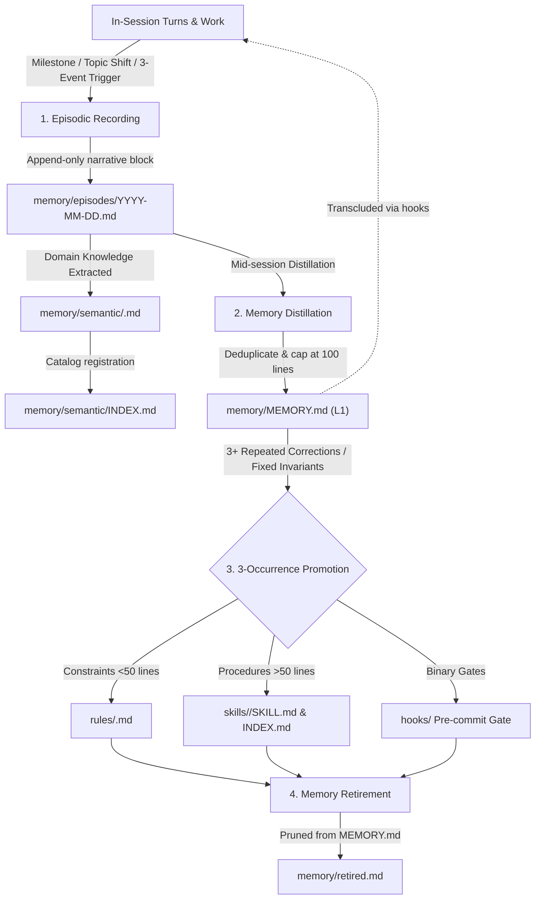

# Harnemon Memory Architecture

A 3-layer autonomous memory harness designed for AI coding agents. Operates without external vector databases or heavyweight background daemons, adhering to zero-dependency progressive disclosure.

---

## 1. The 3 Memory Layers

| Layer | File Path | Scope & Lifecycle | Injection / Recall Method |
| :--- | :--- | :--- | :--- |
| **L1 Resident Memory** | `memory/MEMORY.md` | Core decisions, conventions, active corrections (under 100 lines) | Always-on injected at session start via `transclude.py` |
| **L2 Semantic Knowledge** | `memory/semantic/*.md` | Thematic domain policies, system architecture, integration specs | Indexed in `semantic/INDEX.md`, retrieved on-demand |
| **L3 Raw Episodic Ledger** | `memory/episodes/*.md` | Daily narrative timeline logs of what happened (Append-only) | Recorded mid-session on milestones & topic shifts |

---

## 2. In-Session Autonomous Lifecycle



### 1. Episodic Timeline Logging (`episodes/YYYY-MM-DD.md`)
- **Append-only invariant**: Past entries are never rewritten or deleted.
- **Trigger timing**: Mid-session execution upon:
  1. Milestone completion
  2. Domain or task topic switches
  3. Accumulation of 3+ unrecorded observations
- **Entry format**:
  ```markdown
  HH:MM - <Topic / Policy / Action Title>
  <Concrete narrative description of what occurred, context, policies, or decisions>

  Reference: <Session ID, file path, or context link>
  ```

### 2. Semantic Domain Knowledge (`memory/semantic/`)
- **Living documents**: Organizes evergreen domain knowledge by entity, policy, or system architecture.
- **Progressive disclosure**: Cataloged in `memory/semantic/INDEX.md`. The 1-line index table is transcluded at session start, while full topic documents are loaded on-demand only when relevant.

### 3. In-Session Distillation (`memory/MEMORY.md`)
- **Distilled ledger**: Extracted from episodes, deduplicated, and mapped with source tracking tags (`<!-- id:m-0001 born:... src:... -->`).
- **Token budget**: Capped at 100 lines to prevent prompt bloat.

### 4. 3-Occurrence Promotion Standard
- When a correction, convention, or pattern occurs **3 or more times**:
  - **Rules (`rules/<name>.md`)**: Invariant constraints under 50 lines.
  - **Skills (`skills/<name>/SKILL.md`)**: Multi-step workflows over 50 lines, registered in `skills/INDEX.md`.
  - **Hooks (`hooks/`)**: Absolute binary gates enforced before commits.
- Promoted memories are retired from `MEMORY.md` to `memory/retired.md`.

---

## 3. Tool & Platform Integration

- **`AGENTS.md` Wiring**:
  ```markdown
  ## Distilled Memories (MEMORY.md)
  @../.harnemons/<species>/memory/MEMORY.md

  ## Semantic Knowledge (On-demand)
  @../.harnemons/<species>/memory/semantic/INDEX.md
  ```
- **Transclusion Engine**: `transclude.py` hook expands `@` imports into session prompts across Antigravity, Claude Code, Cursor, and Codex, logging execution telemetry to `~/.agents/transclude.log`.
