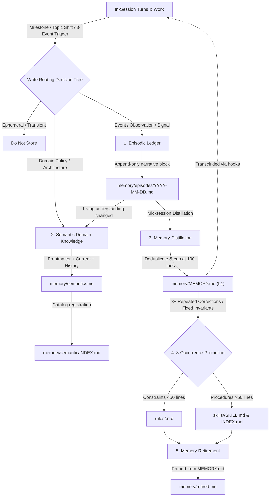

# Harnemon Memory Architecture

A 3-layer autonomous memory harness designed for AI coding agents. Operates without external vector databases or heavyweight background daemons, adhering to zero-dependency progressive disclosure.

---

## 1. The 3 Memory Layers

| Layer | File Path | Scope & Lifecycle | Injection / Recall Method |
| :--- | :--- | :--- | :--- |
| **L1 Resident Memory** | `memory/MEMORY.md` | Core decisions, conventions, active corrections (under 100 lines) | Always-on injected at session start via `transclude.py` |
| **L2 Semantic Knowledge** | `memory/semantic/*.md` | Thematic domain policies, system architecture, integration specs | Indexed in `semantic/INDEX.md`, retrieved on-demand |
| **L3 Raw Episodic Ledger** | `memory/episodes/*.md` | Daily narrative timeline logs of what happened (Append-only) | Recorded mid-session on milestones & topic shifts |

---

## 2. In-Session Autonomous Lifecycle



---

## 3. Write Routing Decision Tree

When encountering new information, user corrections, or domain discoveries during active sessions, follow this decision tree:

1. **Is the information durable beyond the current session?**
   - **No** ➔ Keep it ephemeral in turn context; do NOT write to durable memory.
   - **Yes** ➔ Proceed to Step 2.

2. **Is it event-like, an immediate observation, or a work-in-progress signal?**
   - **Yes** ➔ Append to today's episodic ledger: `memory/episodes/YYYY-MM-DD.md`.
   - **No** (Direct domain fact or policy) ➔ Proceed to Step 3.

3. **Did the observation establish or modify a durable domain policy, architecture, or entity understanding?**
   - **Yes** ➔ Update or create the primary topic document: `memory/semantic/<topic>.md`.
     - **Write Shape**:
       - `Frontmatter`: Topic metadata (topic slug, domain/scope).
       - `## Current`: Concise, up-to-date factual state (rewritten only when understanding changes).
       - `## History`: Append-only chronological trail referencing source episodes (`src: episodes/YYYY-MM-DD.md`).
     - **Index**: Register a 1-line summary in `memory/semantic/INDEX.md`.
   - **No** ➔ Retain as raw episode in `memory/episodes/`.

4. **Is the knowledge globally critical to default agent behavior at session start across multiple tasks?**
   - **Yes** ➔ Distill into `memory/MEMORY.md` (keep strictly under 100 lines, with tracking tag `<!-- id:m-0001 ... -->`).
   - **No** ➔ Keep in `memory/semantic/<topic>.md` (retrieved on-demand only).

5. **Has a convention, constraint, or playbook repeated 3+ times?**
   - **Constraints (<50 lines)** ➔ Promote to `rules/<name>.md`.
   - **Playbooks (>50 lines)** ➔ Promote to `skills/<name>/SKILL.md` + register in `skills/INDEX.md`.
   - **Retire**: Prune promoted items from `MEMORY.md` into `memory/retired.md`.

---

## 4. Semantic Page Standard (Current + History)

Every topic document in `memory/semantic/<topic>.md` follows the structured format:

```markdown
---
topic: <topic-slug>
domain: <domain-or-scope>
---

# <Topic Title>

## Current
- <Concise bullet points of current facts, active policies, or architecture design>
- <Rewritten ONLY when stable understanding changes>

## History
- YYYY-MM-DD: <Summary of change or observation> (src: episodes/YYYY-MM-DD.md)
- YYYY-MM-DD: <Summary of earlier policy discovery> (src: episodes/YYYY-MM-DD.md)
```

---

## 5. Tool & Platform Integration

- **`AGENTS.md` Wiring**:
  ```markdown
  ## Distilled Memories (MEMORY.md)
  @../.harnemons/<species>/memory/MEMORY.md

  ## Semantic Knowledge (On-demand)
  @../.harnemons/<species>/memory/semantic/INDEX.md
  ```
- **Transclusion Engine**: `transclude.py` hook expands `@` imports into session prompts across Antigravity, Claude Code, Cursor, and Codex, logging execution telemetry to `~/.agents/transclude.log`.
